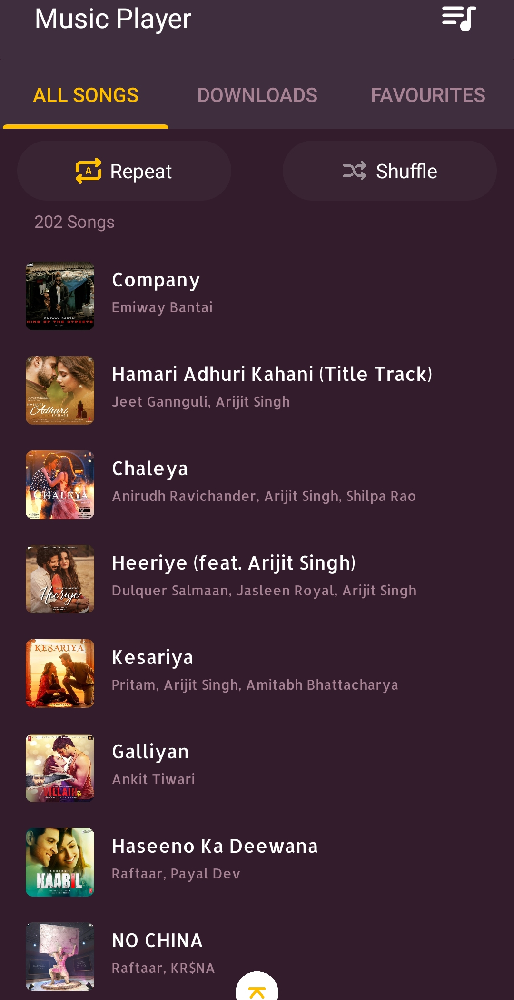
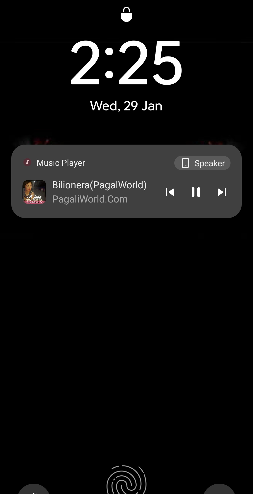
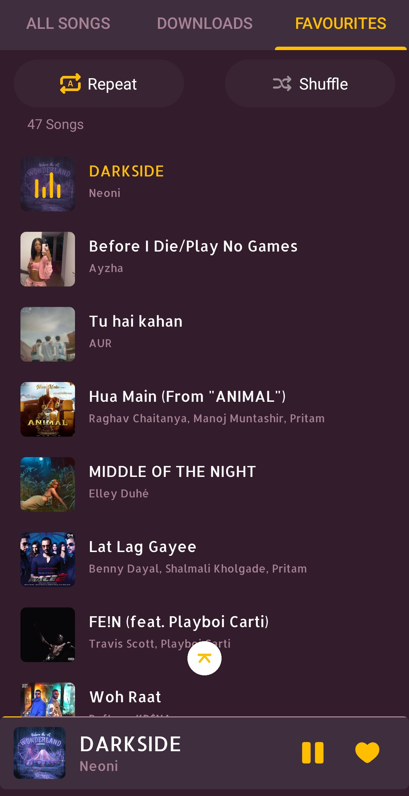
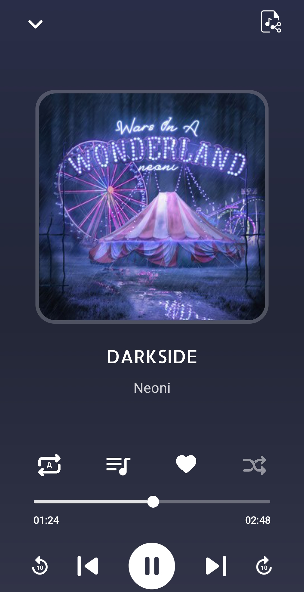

#  Android Music Player App

A modern, responsive, and beautiful music player for Android devices. Built using Material Design, Glide, VLC, and more — designed for smooth performance and clean UI.

---

## 📥 APK Download

👉 **[Download Latest APK from GitHub Releases](https://github.com/MohammedKaif-3/Music-Player/releases/download/v1.0.0/Music-Player.apk)**

- ✅ `app-arm64-v8a-release.apk` – optimized for most 64-bit Android devices
- ✅ `app-armeabi-v7a-release.apk` – compatible with older 32-bit devices
- ✅ `universal.apk` – includes all supported ABIs (slightly larger)

---

## 📸 Screenshots

<div>
   
   
   
   
   
</div>


## 🌟 Features

- 🎧 High-quality local audio playback with VLC
- 📂 Auto-detects and lists music from device storage
- ❤️ Save favorite songs using SQLite local database
- 🔁 Loop and 🔀 Shuffle functionality
- 🖼️ Dynamic color theming using Palette API
- ✨ Lottie animations for rich transitions and icons
- 🎛️ Full playback controls: play, pause, skip, seek
- 🧭 Swipe navigation using ViewPager2
- 📱 Responsive layout with SDP & SSP
- 🎨 Clean, modern Material Design UI

---

## 🛠 Dependencies

- **Lottie** – for adding beautiful animations
- **Palette** – to extract vibrant colors from album art
- **Glide** – for efficient album art loading and caching
- **VLC (libvlc)** – as the robust audio playback engine
- **AndroidX Media** – for handling media sessions and notifications
- **ViewPager2** – to enable swiping between screens
- **SDP & SSP** – to ensure responsive scaling on all screen sizes
- **Material Components & ConstraintLayout** – for modern, flexible UI
- **JUnit & Espresso** – for testing and automation

---

## ⚙️ Getting Started

1. Clone this repo:

   ```bash
   git clone https://github.com/MohammedKaif-3/Music-Player.git
   ```

2. Open the project in **Android Studio**

3. Run the app on a device or emulator.

---

## 👨‍💻 Author

Developed by **Mohammed Kaif**  
Email: [mohammedzaif61@gmail.com](mailto:mohammedzaif61@gmail.com)  
LinkedIn: [mohammedkaif003](https://www.linkedin.com/in/mohammedkaif003)  
GitHub: [MohammedKaif-3](https://github.com/MohammedKaif-3)

---

## 📄 License

This project is licensed under the [MIT License](LICENSE).

---
